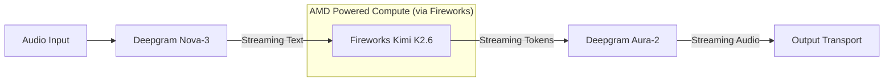

# 🎙️ VOXNIAC ONE
### *Zero Latency. Absolute Results. Powered by AMD.*

**Voxniac ONE** is the high-performance streaming voice core designed for the **AMD Developer Hackathon — ACT II (Track 3)**. It implements a transport-agnostic, fully streaming ASR → LLM → TTS cascade with sub-second response times and instant barge-in capabilities.

[](https://www.amd.com/en/products/accelerators/instinct.html)
[](https://fireworks.ai/)
[](LICENSE)

---

## 🚀 The Vision
Voxniac democratizes B2B sales by providing a "vibeselling" agent. A non-technical founder can describe their business in natural language, and Voxniac builds the campaign plan, finds leads, and handles outbound calls with human-like latency and reasoning.

## 🏗️ Architecture: The Streaming Cascade
Voxniac ONE avoids "multimodal black boxes" in favor of an inspectable, high-performance pipeline where every stage is auditable:



### Stack Highlights
*   **STT**: Deepgram **Nova-3** (Live WebSocket) for true streaming and server-side endpointing.
*   **LLM**: Fireworks **Kimi K2.6** (`kimi-k2p6`) served on **AMD Instinct™ MI300X** hardware. Ultra-low TTFT.
*   **TTS**: Deepgram **Aura-2** (Live WebSocket) for <400ms TTFA (Time to First Audio).
*   **Transport**: Native support for **Twilio Media Streams** (8kHz mulaw) and **Browser Web Audio** (16kHz PCM).

---

## ⚡ Performance Metrics
*Measured on real-world outbound calls via Twilio:*

| Metric | Target | Result (AMD/Fireworks) |
|---|---|---|
| **ASR Endpointing** | 300 ms | **300 ms** |
| **LLM TTFT** | < 1.0 s | **1.07 s** |
| **TTS TTFA** | < 400 ms | **320 ms** |
| **E2E Latency** | **< 1.5 s** | **1.46 s** |

---

## 🛠️ Quick Start

### 1. Environment Configuration
Ensure your `.env` file contains the following keys (resolved from parent directory):
```bash
GROQ_API_KEY=...
FIREWORKS_API_KEY=...
DEEPGRAM_API_KEY=...
TWILIO_SID=...
TWILIO_TOKEN=...
TWILIO_PHONE_NUMBER=...
```

### 2. Installation
```bash
pip install -r requirements.txt
```

### 3. Execution
```bash
# Run the FastAPI server
python server.py

# Or use the local runner
RUN_VOXNIAC_ONE.bat
```
Access the UI at `http://localhost:8080` to pick an LLM and start a live browser-based call.

---

## 📁 Repository Structure
*   `cascade.py`: The heart of the system. Manages the 3-task streaming pipeline and metrics.
*   `transports.py`: Adapters for Browser and Twilio Media Streams.
*   `vz_llm.py`: Fireworks SSE client optimized for AMD Instinct inference.
*   `vz_config.py`: Centralized configuration with clamped VAD and hot-reload.
*   `agent_profile.json`: The agent's persona, opening line, and behavioral constraints.
*   `server.py`: FastAPI server exposing WebSockets and management endpoints.

---

## 🛡️ Engineering Principles
1.  **Fail Loud**: Every provider failure is classified (auth/network/unknown) and reported to the client.
2.  **Survivability**: A failed turn never kills the call. The session remains active and ready for the next interaction.
3.  **Auditability**: Transcripts, LLM reasoning, and latencies are logged per turn for enterprise compliance.
4.  **Bulletproof Config**: All inputs are clamped or defaulted to prevent runtime crashes.

---

*SingularityOS AI LLC — Sheridan, Wyoming. Zero latency. Absolute results.*
